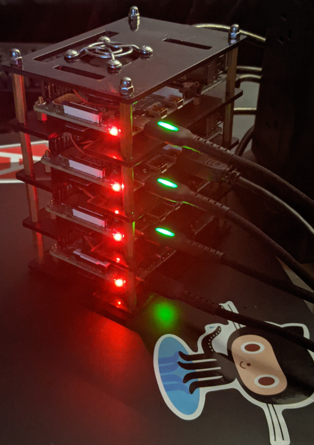

# k8s-pi-cluster
Raspberry Pi Kubernetes cluster

|Platform||
|----|---|
|OS| Raspberry Pi OS (Buster)|

## Hardware:
* x1 Raspberry Pi 3B (master node)
* x3 Raspberry Pi 4B (worker nodes)
* x3/x1 USB-C, Micro USB cables
* x1 Network Switch
* x4 Ethernet cables
* x4 128 GB microSD cards
* x1 pi cluster rack with fans

## Setup
1. Flash a Raspberry Pi OS Buster image to each SD card.
